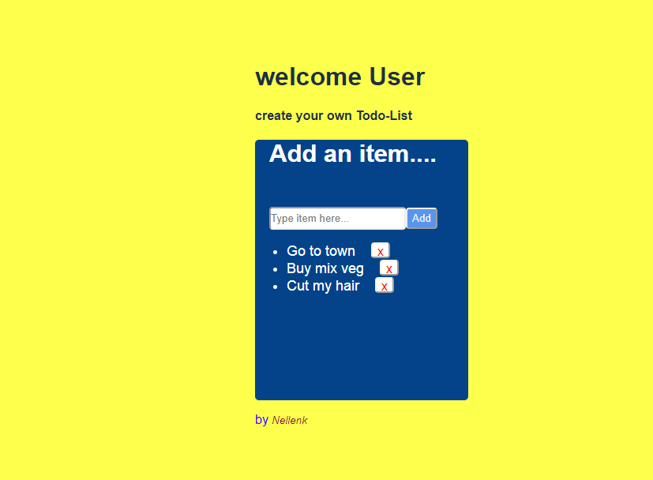

# Todo-list app

This project was bootstrapped with [Create React App](https://github.com/facebook/create-react-app).

## what it does
It is the frontend react-app that allow the user to create todo-list. The app have butttons that allow the user to delete or add the listto the app.

## Built With

- React.js,
- CSS3,
- Jsx

## screenshoot

## Live Demo
 [Live Demo](https://blissful-blackwell-835e7c.netlify.app/)

👤 **Author**

- Github: [@nellencr](https://github.com/nellencr)
- Twitter: [Nella](https://twitter.com/Nella75794271)
- Linkedin: [Nela Komane](https://www.linkedin.com/in/nela-komane-8866b9192/)
- Email: nellencr@gmail.com
